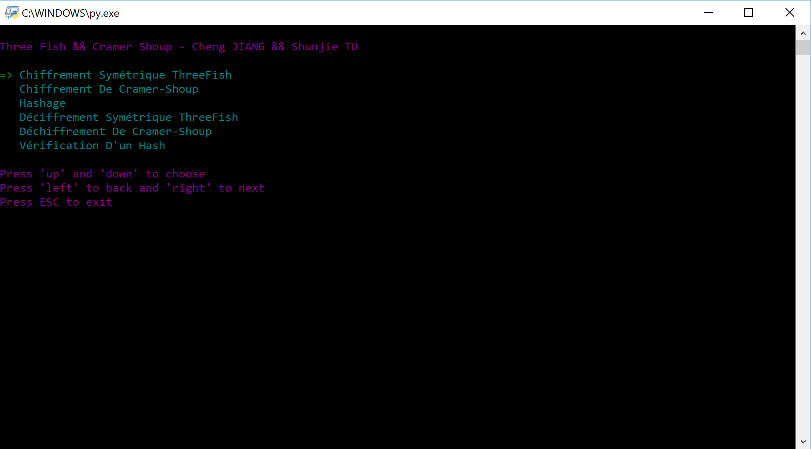

# ThreeFishAndCramerShoup

The Implementation Of ThreeFish And CramerShoup In Python3

## Environement

```
Python3.6.3 + Any(windows, darwin, linux)
```

## Installation

```bash
git clone https://github.com/GopherJ/ThreeFishAndCramerShoup
cd ThreeFishAndCramerShoup
pip3 install -r requirements.txt
```

## Support

- [md5](https://github.com/GopherJ/ThreeFishAndCramerShoup/blob/master/md5.py)
- [threefish](https://github.com/GopherJ/ThreeFishAndCramerShoup/blob/master/fish.py)
- [cramershoup](https://github.com/GopherJ/ThreeFishAndCramerShoup/blob/master/cramer.py)

## Utilisation

```
cd ThreeFishAndCramerShoup
sudo ./cmd.py
```

## Demo



## License

MIT License
